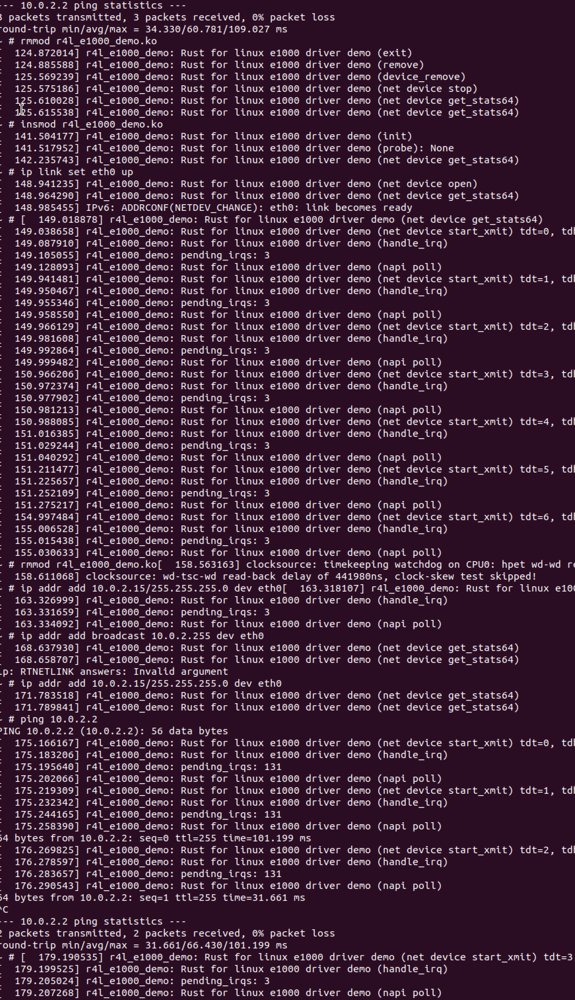

# 作业 4：为 e1000 网卡驱动添加 remove 代码

在`linux/rust/kernel/pci.rs`添加 remove 所需要的 Device 引用

```rust
/// A PCI driver
pub trait Driver {
    ...
    /// PCI driver remove.
    ///
    /// Called when a platform device is removed.
    /// Implementers should prepare the device for complete removal here.
    fn remove(dev:&mut Device, _data: &Self::Data);
}

impl<T: Driver> Adapter<T> {
    extern "C" fn remove_callback(pdev: *mut bindings::pci_dev) {
        // SAFETY: `pdev` is guaranteed to be a valid, non-null pointer.
        let ptr = unsafe { bindings::pci_get_drvdata(pdev) };
        // SAFETY:
        //   - we allocated this pointer using `T::Data::into_pointer`,
        //     so it is safe to turn back into a `T::Data`.
        //   - the allocation happened in `probe`, no-one freed the memory,
        //     `remove` is the canonical kernel location to free driver data. so OK
        //     to convert the pointer back to a Rust structure here.
        let data = unsafe { T::Data::from_pointer(ptr) };
        let mut dev = unsafe { Device::from_ptr(pdev) };
        T::remove(&mut dev, &data);
        <T::Data as driver::DeviceRemoval>::device_remove(&data);
    }
}

```

在内核中的修改之后，需要运行`make LLVM=1 -j$(nproc)`重新编译内核。

在 Device struct 中 impl clear_master(), disable_device()和 release_selected_regions(bars)这几个函数提供 C 代码下 binding

```rust

impl Device {
    /// disables bus-mastering for device
    pub fn clear_master(&self) {
        unsafe { bindings::pci_clear_master(self.ptr) };
    }

    /// Disable device
    pub fn disable_device(&mut self){
        unsafe { bindings::pci_disable_device(self.ptr) };
    }

    /// Release selected PCI I/O and memory resources
    pub fn release_selected_regions(&mut self, bars: i32) {
        // SAFETY: By the type invariants, we know that `self.ptr` is non-null and valid.
        unsafe { bindings::pci_release_selected_regions(self.ptr, bars) };
    }

}
```

在 src_e1000/r4l_e1000_demo.rs 中 remove 函数添加下面函数调用

```rust

impl driver::DeviceRemoval for E1000DrvPrvData {
    fn device_remove(&self) {
        pr_info!("Rust for linux e1000 driver demo (device_remove)\n");
        drop(&self._netdev_reg);
    }
}

impl pci::Driver for E1000Drv {
    ...

    fn remove(dev: &mut pci::Device, data: &Self::Data) {
        pr_info!("Rust for linux e1000 driver demo (remove)\n");
        let netdev_reg = &data._netdev_reg;
        let netdev = netdev_reg.dev_get();
        let bars = data.bars;

        dev.release_selected_regions(bars);
        dev.clear_master();
        dev.disable_device();

        netdev.netif_carrier_off();
        netdev.netif_stop_queue();

        drop(netdev_reg);
        drop(netdev);
    }
}
```

在进入 linux 环境之后运行以下脚本卸载模块

```
rmmod r4l_e1000_demo.ko
```

再次加载模块并 ping 通


