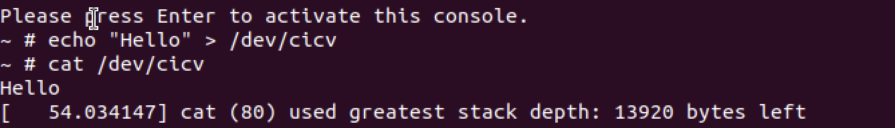

# 作业 5：注册字符设备

添加 samples/rust/rust_chrdev.rs 文件

```rust
    fn write(_this: &Self,_file: &file::File,_reader: &mut impl kernel::io_buffer::IoBufferReader,_offset:u64,) -> Result<usize> {
        let offset = _offset.try_into()?;
        let mut vec = _this.inner.lock();
        let len = core::cmp::min(_reader.len(), vec.len().saturating_sub(offset));
        _reader.read_slice(&mut vec[offset..][..len])?;
        Ok(len)

    }

    fn read(_this: &Self,_file: &file::File,_writer: &mut impl kernel::io_buffer::IoBufferWriter,_offset:u64,) -> Result<usize> {
        let offset = _offset.try_into()?;
        let vec = _this.inner.lock();
        let len = core::cmp::min(_writer.len(), vec.len().saturating_sub(offset));
        _writer.write_slice(&vec[offset..][..len])?;
        Ok(len)
    }
```



Q：作业 5 中的字符设备/dev/cicv 是怎么创建的？它的设备号是多少？它是如何与我们写的字符设备驱动关联上的？

通过 build_image.sh 文件中命令创建

```
mknod /dev/cicv c 248 0
```

- c 表示这是一个字符设备。
- 248 是主设备号，0 是次设备号。

字符设备文件的文件操作由驱动程序中的 file::Operations trait 的函数来处理。当用户对 /dev/cicv 进行操作（如 open、read、write 等）时，内核会调用这些函数。
